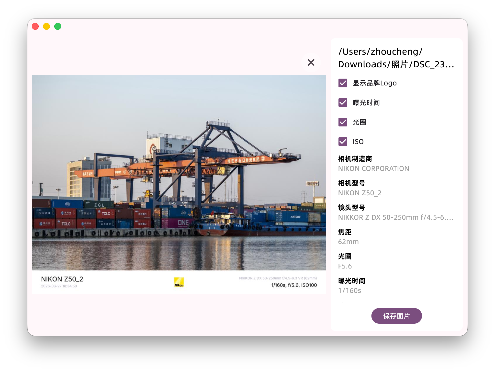
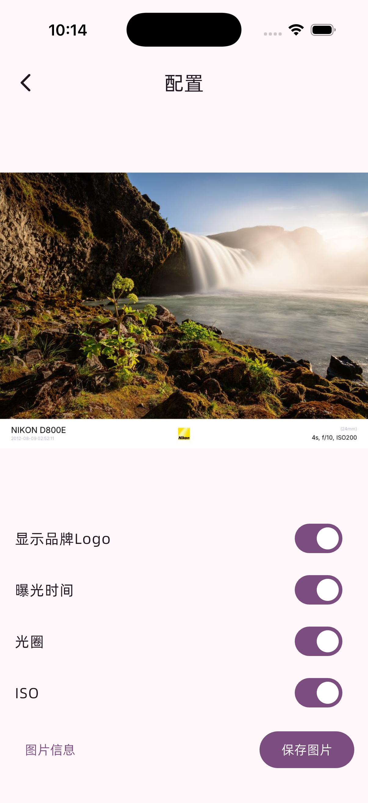

# EXIF Helper

Also available in English. Click [HERE](/documents/en.md) to view the English version of the README

## 简介


<a href="https://apps.microsoft.com/detail/9p6389wjjj8k?referrer=appbadge&mode=direct">
	
</a>

支持Windows，macOS，Android和iOS

动态库组件仓库[在这里](https://github.com/Zhoucheng133/EXIF-Helper-Core)

## 截图





## 在你的设备上配置EXIF Helper

你需要在你的设备上安装Flutter和Go

### 构建动态/静态库

核心组件在`/core`目录下，使用Go开发，构建方式见[Flutter FFI Template](https://github.com/Zhoucheng133/Flutter-FFI-Template)

对于Windows, macOS, Android和iOS平台，本项目包含已经构建好的二进制动态/静态库

- Windows: `/windows/image.dll`
- macOS: `/macos/image.dylib`
- Android: `/android/app/src/main/jniLibs/arm64-v8a/libcore.so`
- iOS: `/ios/libcore.xcframework`

### 构建App本体

本项目使用的Flutter版本为`3.41.6`，不要使用低于`3.38`的Flutter构建

所有平台的构建时，二进制动态/静态库都会拷贝到构建的App中

```bash
# Windows
flutter build windows
# macOS
flutter build macos
# Android
flutter build apk --split-per-abi
```

## 赞助

如果有帮助到了你，欢迎[给我投喂](https://blog.z-server.top/sponsor/)谢谢 🙏