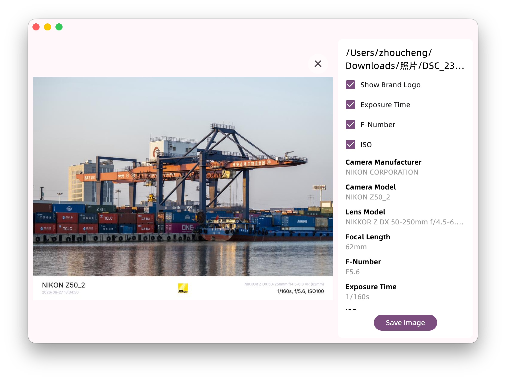

# EXIF Helper

## Introduction


<a href="https://apps.microsoft.com/detail/9p6389wjjj8k?referrer=appbadge&mode=direct">
    
</a>

Supported OS: Windows 10+ & macOS

The repository for the dynamic library component is located [HERE](https://github.com/Zhoucheng133/EXIF-Helper-Core).

## Screenshots



## Configuring EXIF Helper on Your Device

You need to have Flutter and Go installed on your device.

1. Go to the [Dynamic Library Component Repository](https://github.com/Zhoucheng133/EXIF-Helper-Core) to build the `dll` (Windows) or `dylib` (macOS):

    ```bash
    # Inside the EXIF-Helper-Core repository
    go mod tidy
    
    # For Windows
    go build -o build/image.dll -buildmode=c-shared .
    
    # For macOS
    go build -o build/image.dylib -buildmode=c-shared .

    # If you are using a newer version of Golang, use the following commands to generate the dynamic library:
    # macOS
    go build -buildmode=c-shared -ldflags="-s -w" -o build/core.dylib
    # Windows
    go build -buildmode=c-shared -ldflags="-s -w" -o build/core.dll
    ```

2. Build the App itself:
    ```bash
    # For Windows
    flutter build windows
    
    # For macOS
    flutter build macos
    ```

3. Copy the generated dynamic library into the App directory<sup>*</sup>

<sup>*</sup> For Windows: Copy it directly to the App root directory. For macOS: Copy it to `EXIF Helper/Contents/Frameworks` (the project will attempt to copy this automatically, or you can manually keep the library files in the project). Note: **Do not rename the dynamic library file.**

## Sponsor

If this project was helpful, consider [buying me a coffee](https://blog.z-server.top/sponsor/). Cheers! ☕