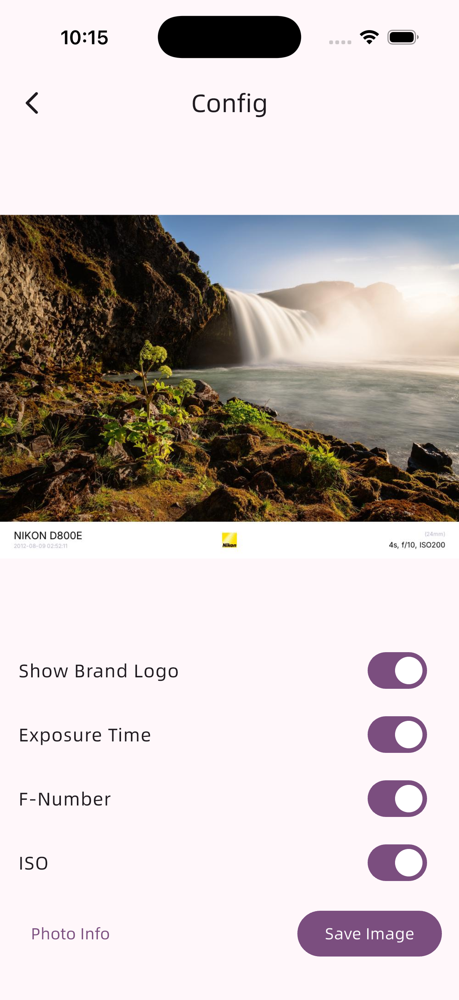

# EXIF Helper

## Introduction


<a href="https://apps.microsoft.com/detail/9p6389wjjj8k?referrer=appbadge&mode=direct">
    
</a>

Support Windows, macOS, Android and iOS

The repository for the dynamic library component is located [HERE](https://github.com/Zhoucheng133/EXIF-Helper-Core).

## Screenshots




## Configuring EXIF Helper on Your Device

You need to have Flutter and Go installed on your device.

### Build Dynamic/Static Libraries

The core component is located in the `/core` directory and is developed using Go. For build instructions, refer to [Flutter FFI Template](https://github.com/Zhoucheng133/Flutter-FFI-Template).

For Windows, macOS, Android, and iOS platforms, this project includes pre-built binary dynamic/static libraries.

- Windows: `/windows/image.dll`
- macOS: `/macos/image.dylib`
- Android: `/android/app/src/main/jniLibs/arm64-v8a/libcore.so`
- iOS: `/ios/libcore.xcframework`

### Build the App

This project uses Flutter version `3.41.6`. Do not use Flutter versions lower than `3.38` for building.

When building for any platform, the binary dynamic/static libraries will be copied into the built App automatically.

```bash
# Windows
flutter build windows

# macOS
flutter build macos

# Android
flutter build apk --split-per-abi
```

## Sponsor

If this project was helpful, consider [buying me a coffee](https://blog.z-server.top/sponsor/). Cheers! ☕